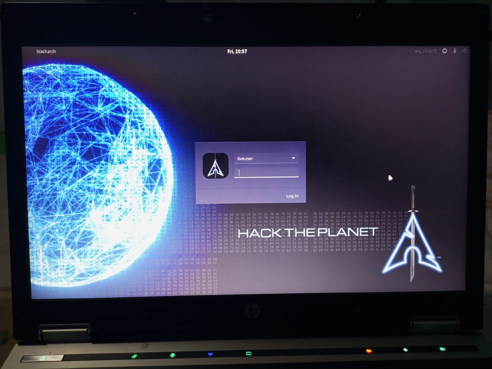

## The Process
I have always wanted to use a Linux Operating System by itself rather than just using a Virtual machine but I hesitated since my PC at the time was slow and I could only upgrade it to 6GB RAM at the time. 

Pushing away all the discouraging factors, I decided to dual boot my PC anyway but with BlackArch, which is an Arch-based distro and it was a brave move considering I had never interacted with it before and you have to manually setup everything. I just wanted a brief moment of being able to say “I use Arch btw”.

In the process I went through a lot of errors and learnt a lot through them which made me glad that I had taken the risk regardless of the experience I had at the time and I’m glad to share what I learnt.

My C: Drive on Windows to me was of good storage to partition as half of it was free but when I proceeded to partition, the available shrink space was only 828 MBs😆

This was so unexpected and I tried to look for answers but most were centered on clearing files. That was until I discovered shadow files which are copies of configuration files that are used for backup or to track changes. This was okay but shadow files occupy a lot of space and data can be breached easily as most are unencrypted.

Crucial data like passwords can be retrieved by malicious people once they access your shadow files. Deleting shadow files doesn't cause loss of data in your machine and with this I deleted all shadow files in my Windows and the change was astronomical, from 828MBs to about 80GB free shrink space to partition!

## Tip💡
To delete shadow files on your Windows machine, go to the command prompt as an administrator and enter the following command.

`vssadmin delete shadows /for=c: /all`

This will delete all your shadow files and give you more space in your drive.

More commands on deleting shadow files on Windows are [here](https://learn.microsoft.com/en-us/windows-server/administration/windows-commands/vssadmin-delete-shadows).

## Take-Away

I really enjoyed the learning process through the issues I faced with my storage. The learning process does not end there as through installing BlackArch Linux, I embarked on a great learning journey, I've encountered a lot of errors during configuration especially with updating packages using pacman but through them I got to appreciate the impact of open source communities that have great material and their openness to share errors they've once encountered and how they solved them.

> You never miss someone who has experienced the same issue as you on the Internet, always do your research before giving up. If you don’t find someone who has asked on the issue you’re facing, you can take the step to ask about it and who knows? You might get a response and be the online savior of someone who also faces the same problem in the future!✨
---