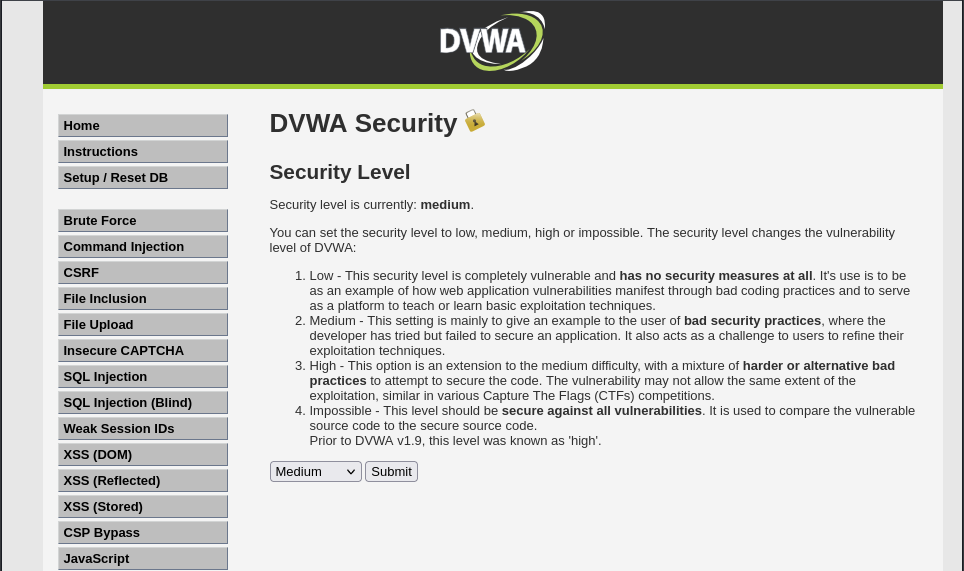
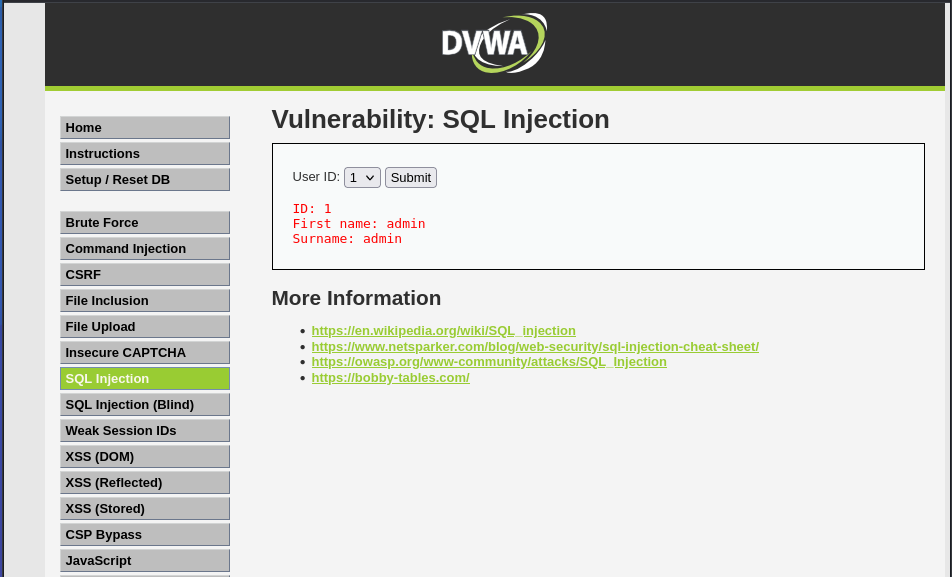
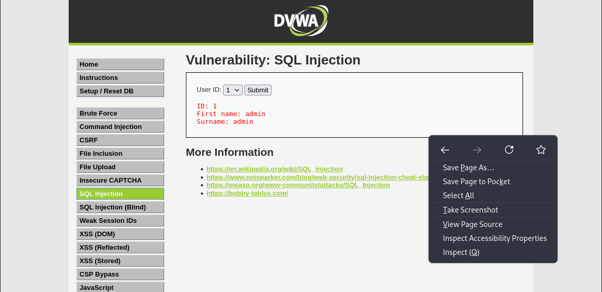
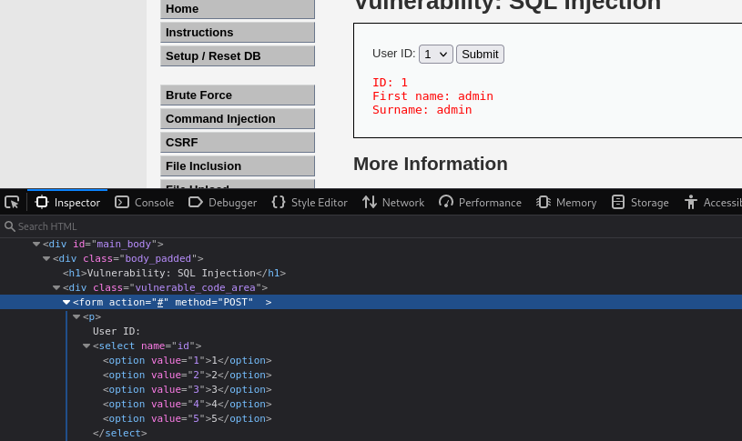
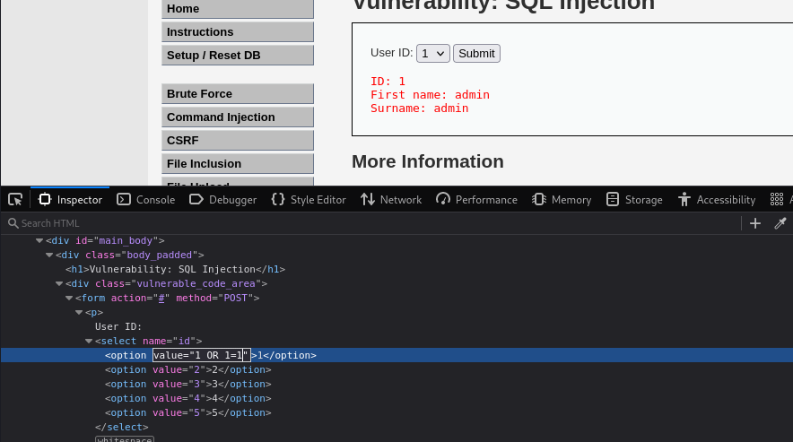
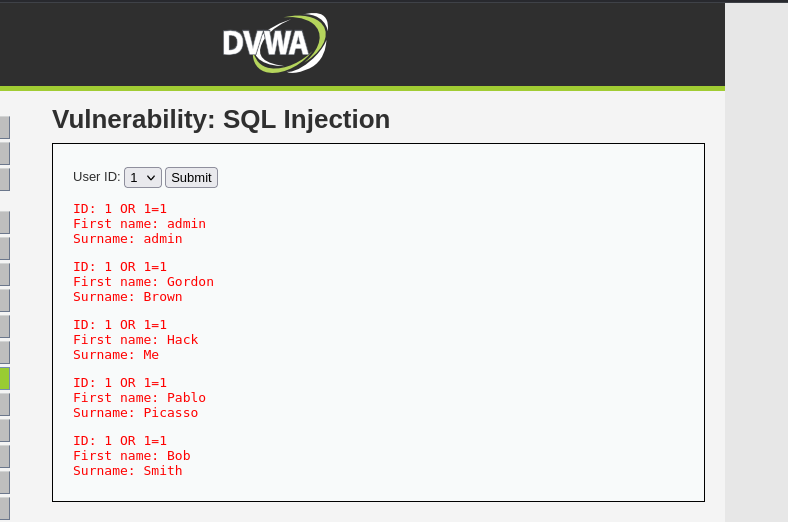

## DVWA Security Analysis: Uncovering SQL Injection Risks

 An SQL Injection is a technique that involves malicious actors inserting harmful code into an application's SQL queries through input fields especially those lacking proper validation checks. 
 
 The risk level is significant as once inside, the attacker can wreak havoc, accessing sensitive data like user credentials or even taking control of the entire database. 

### Setting up your Kali environment
Let's get straight into this! First we need to setup our environment to get into the platform. I used Kali Linux to set up the Damn Vulnerable Web Application. 

[Setup your Kali Linux machine for DVWA using Docker](https://medium.com/@Muriithi_nancy/how-to-setup-dvwa-on-docker-a3819ec25f78)

If you have a different OS, no worries! DVWA can also be used with other OSs like [Windows](https://youtu.be/Yzksa_WjnY0), Ubuntu and you can find tutorial to set it up on YouTube or your preferred browser.

### Steps to Reproduce the Vulnerability
We're now in! Hopefully you've followed through the installation tutorial and used the default login credentials (username: admin and password: 
password). 

1. Set the Security level to medium on the DVWA Security Settings.

2. On the vulnerability menu list select SQL Injection to 
access the vulnerability. Click on the submit button and details of a user with ID 1 is outputted. The User ID dropdown list contains 4 user IDs that output different 
information.

3. Inspect the codes of the website by right clicking and 
selecting the Inspect option or you can use keyboard shortcuts i.e. Ctrl + Shift + Q or F12. 

5. On inspecting, we see a form tag in which the user IDs are listed, it contains a POST method meaning POST the data entered by the user in the form fields is sent in the body of the HTTP request to the server.

 8. With this knowledge, we can try the common SQL 
Injection commands and see if the response will be 
different. On the value attribute, add the always true statement (OR ‘1’=‘1’) but this time excluding the quote marks (OR 1= 1) as there are no double quotes on the original SQL 
query. This is to circumvent the password verification 
process and let the database return all the users records 
without checking the password.

10. Click the submit button after adding the command to the code and you will see a different output. The output includes all the users in the database 
including the admin.

## Expected vs Actual Results
 The website should have implemented proper input validation and sanitization measures to prevent SQL injection attacks. This was not the case and instead, the website was vulnerable to SQL injection attacks allowing an attacker to access all the users in the website's database.

## Impact of SQL Injections 
Let's discuss the effect SQL Injections can cause to an organizations or users in general.

 ⬡ Sensitive information stored in the database such as user credentials get exposed.

 ⬡ Attackers can modify or delete existing data in the database causing data loss.

 ⬡ When attackers execute arbitrary SQL queries, this will potentially lead to complete system compromise.

## How can We mitigate this Vulnerability? 
 1. Inputing validation and Sanitization measures to prevent SQL injection attacks.
 2. Using prepared statements or stored procedures when executing SQL queries.
 3. Following the principle of least privilege in accessing the database.

## Take-Away
This was a fun exercise for me personally and I hope it was the same for you. SQL Injections can pose a great damage to websites in data leakage. With appropriate mitigation actions, SQL Injections can be prevented. 

Happy Hacking and remember... 
> With great power, comes great responsibility.

---